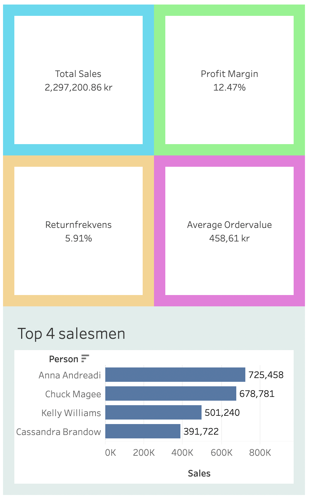

# superstore-first-edition

# Superstore Dashboard – First Edition

📊 This is my first Tableau dashboard, created as part of my Business Intelligence learning journey.  
It is based on the Superstore sample dataset and focuses on key sales performance metrics.

## 🧠 Project Goals
- Practice Tableau basics (data modeling, layout, formatting)
- Build a clean KPI-focused dashboard
- Publish and document it as part of my BI portfolio

## 📈 KPIs Included
- Total Sales (kr)
- Profit Margin (%)
- Return Rate (%)
- Average Order Value (kr)
- Top 3 Sellers

## 🖼️ Screenshot

## 🌐 Live Dashboard

👉 [View it on Tableau Public](https://public.tableau.com/app/profile/victor.wahlstr.m/viz/SuperstoreSalesDashboard-FirstEdition/Dashboard)

## 🚀 What's next?
This is "First Edition". Future editions will add filters, interactivity, and deeper visual analysis.

